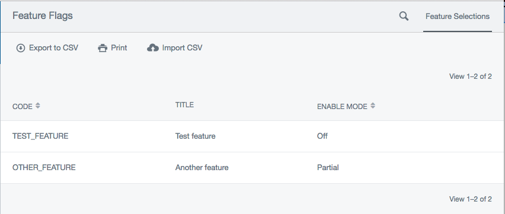

Feature Flags
=============

This experimental module is for allowing admin-controlled feature flags in a SilverStripe app.

Releases
--------


 * `silverstripe/featureflags:~0.1.0`: compatible with SilverStripe 3. `0.1` branch in git.
 * `silverstripe/featureflags:~0.2.0`: compatible with SilverStripe 4. `master` branch in git.


Usage
-----

If your application code, use `SilverStripe\FeatureFlags\FeatureFlag::isEnabled` to determine if a flag
is set.

### Making code feature-dependent

```php
use SilverStripe\FeatureFlags\FeatureFlag;
// ...
if(FeatureFlag::isEnabled('FEATURE_NAME', [ "Member" => Member::currentUser() ])) {
    $controller->SomeSetting = "some value";
}
```

The first argument is a feature codename. These work similarly to permission codenames. The second argument is
a map of context data, described below.

The module doesn't provide any controls for *how* your application will change if the flag is enabled;
that is up to you.

### Context

Context helps answer the question "when should this feature be shown?" For example, you may have a feature that
you wish to enable for certain members. In other cases, you may have a feature that you wish to enable for certain
projects or pages.

In the first example, `Member` would be required context. In the second example, `Project` or `SiteTree` would be.

Each feature definition (described below) includes a list of the context it expects. Based on this, the admin UI
for controlling feature flags will provid different tools for selecting features.

### Definining new features

To define new features, add new items to the array `SilverStripe\FeatureFlags\FeatureFlag.feature` in your
config:

```yml
SilverStripe\FeatureFlags\FeatureFlag:
  features:
    - code: FEATURE_NAME
      title: My feature 
      context:
        Member: Member
```

Each feature have the following options:

 * **code:** This is the codename passed as the first argument to FeatureFlag::isEnabled(). By convention, we
   recommend UPPER_SNAKE_CASE for these.
 * **title:** This is a title shown in the feature flag admin
 * **context:** This is a map of the required context values. The keys are the context keys, and the values are
   the class or interface that the value passed must derive from. Scalar context is not allowed. Any context values
   specified here that are not passed to `FeatureFlag::isEnabled()` will result in an error.

### Feature admin

Your CMS UI will have a new section, `/admin/featureflags`. This is a simple modeladmin that lists each available
feature and gives you some form controls for choosing which context values will result in an enabled feature.



### Context field providers

For each data type in the context, you will need to have a form control for editing it. These are provided by
"context field providers".By default, we provide a simple context field provider for `SilverStripe\Security\Member`.
This is defined in the class `SilverStripe\FeatureFlags\Context\MemberFieldProvider`.

If you are making feature flags dependent on your own data objects, you will probably want to add your own field
provders. There are two steps necessary to do this:

 * Define a class that implements `SilverStripe\FeatureFlags\Context\FieldProvider`.
 * Attach that class to the FeatureFlagAdmin by adding an entry to the `context_field_providers` config setting.

The config setting looks like this:

```
SilverStripe\FeatureFlags\FeatureFlagAdmin:
  context_field_providers:
    SilverStripe\Security\Member: SilverStripe\FeatureFlags\Context\Member 
```

 * The key should be the context class that you wish to use the field provider with
 * The value should be the class name of the field provider
